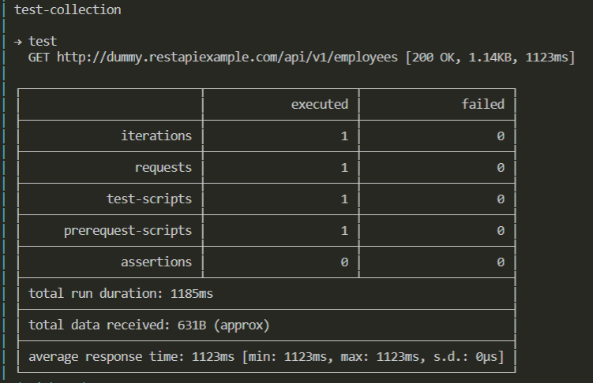

# Docker Newman
> Docker image to run postman collections.

## Installation

## Usage example

## Development setup

## Release History

* 0.0.1
    * Add base implementation + docs

## Contributing

1. Fork it (<https://github.com/DmytroSH/docker-newman>)
2. Create your feature branch (`git checkout -b feature/fooBar`)
3. Commit your changes (`git commit -am 'Add some fooBar'`)
4. Push to the branch (`git push origin feature/fooBar`)
5. Create a new Pull Request